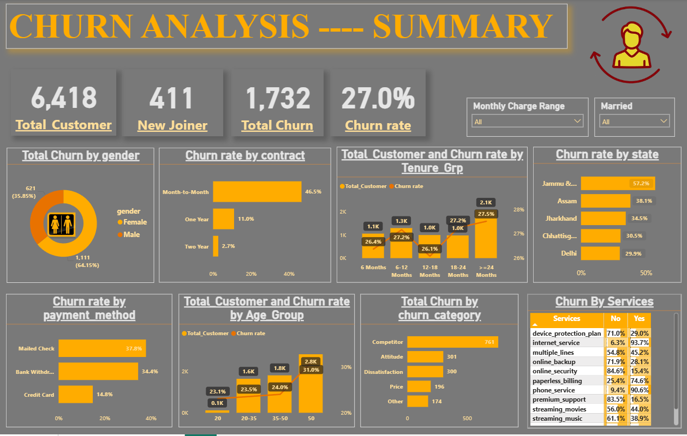

# Customer Churn Analysis

## Project Overview
End-to-end BI project analyzing customer churn using SQL, Power Query, DAX, and Power BI dashboards. Goal: identify churn patterns and provide actionable insights.

### Key Highlights
- Full data pipeline: SQL → Power Query → DAX → Power BI
- Churn prediction and analysis
- Clean, reproducible workflow

## Project Pipeline
### 1. Data (01_data/)
- Raw_data.csv → Original dataset
- cleaned.csv → Cleaned & pre-processed data

### 2. SQL Queries (02_sql/)
- sql_churn_data_pipeline.sql → Data cleaning, feature engineering, churn calculation

### 3. Power Query (03_power_query/)
- Transformations: Churn status, Age/Tenure grouping, Services unpivot

### 4. DAX Measures (04_dax_measures/)
- Summary KPIs: Total Customers, Total Churn, Churn Rate, New Joiners
- Churn Prediction KPIs: Count of predicted churners, dynamic titles

## Tools & Technologies
PostgreSQL | Power BI (Power Query, DAX) | CSV | Git/GitHub

## Key Insights
- Visual dashboards for monitoring churn
- KPI metrics to track customer retention
- Predictive insights to identify at-risk customers
- Demonstrates end-to-end BI skills for real-world analytics

